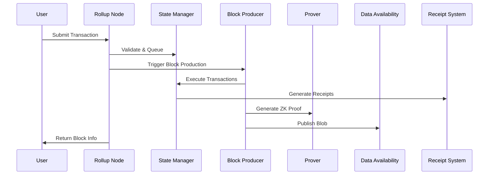

# How It Works

## System Architecture Deep Dive

This document provides a comprehensive technical overview of how the Rollup OS system operates, from transaction submission to final settlement.

## High-Level Flow



## Component Breakdown

### 1. Rollup Node (`rollup-node/src/main.rs`)

The rollup node is the central orchestrator that coordinates all system components.

#### **Core Responsibilities:**
- **Transaction Processing**: Accept, validate, and queue transactions
- **Block Production**: Coordinate block creation and execution
- **API Management**: Provide REST endpoints for system interaction
- **State Coordination**: Manage global application state

#### **Key Data Structures:**

```rust
struct AppState {
    inner: Arc<AppStateInner>,           // State management
    tx_queue: Arc<Mutex<Vec<Tx>>>,       // Transaction queue
    transactions_per_block: u64,         // Block size config
    blob_builder: Arc<Mutex<BlobBuilder>>, // Data availability
}

struct Tx {
    pub from: String,      // Sender address
    pub to: String,        // Receiver address
    pub amount: String,    // Transfer amount
    pub nonce: u64,        // Transaction nonce
}
```

#### **API Endpoints:**

| Endpoint | Method | Purpose |
|----------|--------|---------|
| `/tx` | POST | Submit transaction |
| `/state/:addr` | GET | Query account state |
| `/block/produce` | POST | Create new block |
| `/block/:num/receipts` | GET | Get block receipts |
| `/block/:num/stats` | GET | Get execution statistics |
| `/blob/create` | POST | Create data availability blob |
| `/init_account` | POST | Initialize account |

### 2. State Management (`rollup-node/src/state.rs`)

The state manager handles all account data and transaction execution.

#### **Account Structure:**
```rust
struct Account {
    pub balance: u128,    // Account balance
    pub nonce: u64,       // Transaction counter
}
```

#### **Transaction Execution Flow:**

1. **Validation Phase:**
   - Check nonce validity
   - Verify sufficient balance
   - Validate transaction format

2. **Execution Phase:**
   - Update sender balance and nonce
   - Update receiver balance
   - Generate transaction receipt

3. **Commitment Phase:**
   - Calculate new state root
   - Update block number
   - Store execution results

#### **State Root Calculation:**
```rust
fn commit_block(&self, block_number: u64) -> (u64, String) {
    let mut hasher = Sha256::new();
    hasher.update(block_number.to_string().as_bytes());
    
    for (addr, account) in accounts.iter() {
        hasher.update(addr.as_bytes());
        hasher.update(account.balance.to_string().as_bytes());
        hasher.update(account.nonce.to_string().as_bytes());
    }
    
    let result = hasher.finalize();
    hex::encode(result)
}
```

### 3. Receipt System (`rollup-node/src/receipt.rs`)

The receipt system provides comprehensive transaction execution tracking and accountability.

#### **Transaction Status Types:**
```rust
enum TxStatus {
    Success,                    // Transaction executed successfully
    Revert(String),            // Transaction reverted with reason
    InvalidNonce,              // Nonce validation failed
    InsufficientBalance,       // Insufficient funds
    InvalidAmount,             // Invalid amount format
    InvalidOpcode,             // Invalid operation
    GasLimitExceeded,          // Gas limit exceeded
    Other(String),             // Other error types
}
```

#### **Receipt Structure:**
```rust
struct TransactionReceipt {
    pub tx_hash: String,           // Transaction hash
    pub from: String,              // Sender address
    pub to: String,                // Receiver address
    pub amount: u128,              // Transfer amount
    pub nonce: u64,                // Transaction nonce
    pub status: TxStatus,          // Execution status
    pub gas_used: u64,             // Gas consumed
    pub gas_limit: u64,            // Gas limit
    pub block_number: u64,         // Block number
    pub transaction_index: usize,  // Position in block
    pub logs: Vec<String>,         // Event logs
    pub return_data: Vec<u8>,      // Return data
}
```

#### **Receipts Root Calculation:**
The system calculates a Merkle root of all receipts in a block:

```rust
fn calculate_receipts_root(&self, block_number: u64) -> String {
    let mut hashes: Vec<String> = receipts.iter().map(|r| r.hash()).collect();
    
    // Build Merkle tree
    while hashes.len() > 1 {
        let mut next_level = Vec::new();
        for i in (0..hashes.len()).step_by(2) {
            let left = &hashes[i];
            let right = if i + 1 < hashes.len() {
                &hashes[i + 1]
            } else {
                left // Duplicate last element if odd
            };
            
            let mut hasher = Sha256::new();
            hasher.update(left.as_bytes());
            hasher.update(right.as_bytes());
            next_level.push(hex::encode(hasher.finalize()));
        }
        hashes = next_level;
    }
    
    hashes[0].clone()
}
```

### 4. Zero-Knowledge Proof System (`prover/`)

The prover system generates cryptographic proofs for state transitions using Risc0 ZKVM.

#### **Architecture:**
- **Host Code** (`prover/host/`): Manages proof generation and verification
- **Guest Code** (`prover/methods/guest/`): Runs inside ZKVM for secure computation
- **Methods** (`prover/methods/`): Defines the proof interface

#### **Public Inputs:**
```rust
struct PublicInputs {
    pub prev_root: String,      // Previous state root
    pub post_root: String,      // New state root
    pub receipts_root: String,  // Receipts Merkle root
    pub blob_hash: String,      // Data availability blob hash
    pub oracle_commit: String,  // Oracle commitment
}
```

#### **Proof Generation Flow:**

1. **Input Preparation**: Serialize public inputs
2. **Environment Setup**: Create ZKVM execution environment
3. **Proof Generation**: Execute guest code in ZKVM
4. **Output Serialization**: Serialize proof receipt and journal

```rust
pub fn prove_block(inputs: &PublicInputs) -> Result<ProveOutput> {
    let env = ExecutorEnv::builder().write(inputs)?.build()?;
    let prover = default_prover();
    let prove_info = prover.prove(env, methods::GUEST_CODE_FOR_ZK_PROOF_ELF)?;
    let receipt: Receipt = prove_info.receipt;
    
    let journal_bytes = receipt.journal.bytes.clone();
    let receipt_bytes = bincode::serialize(&receipt)?;
    
    Ok(ProveOutput {
        receipt: receipt_bytes,
        journal: journal_bytes,
    })
}
```

#### **Proof Verification:**
```rust
pub fn verify_receipt(receipt_bytes: &[u8]) -> Result<()> {
    let receipt: Receipt = bincode::deserialize(receipt_bytes)?;
    receipt.verify(methods::GUEST_CODE_FOR_ZK_PROOF_ID)?;
    Ok(())
}
```

### 5. Data Availability Layer

The data availability layer ensures transaction data is stored and retrievable.

#### **Blob Builder** (`rollup-node/src/blob_builder.rs`)

Manages the creation of Celestia-compatible blobs:

```rust
struct CelestiaBlob {
    pub namespace_id: String,    // 8-byte namespace ID
    pub data: Vec<u8>,          // Raw blob data
    pub share_version: u8,      // Share version
    pub commitment: String,      // Commitment hash
}

struct BlobMetadata {
    pub blob_id: String,        // Unique blob identifier
    pub block_numbers: Vec<u64>, // Blocks included in blob
    pub transaction_count: usize, // Total transactions
    pub namespace_id: String,    // Celestia namespace
    pub commitment: String,      // Blob commitment
    pub created_at: u64,         // Creation timestamp
}
```

#### **Blob Creation Process:**

1. **Block Grouping**: Group blocks by configured size (default: 5 blocks per blob)
2. **Data Serialization**: Serialize block and transaction data
3. **Commitment Calculation**: Generate SHA256 hash of blob data
4. **Storage**: Save blob and metadata to local storage

#### **Data Availability Publisher** (`rollup-node/src/da_publisher.rs`)

Handles the publishing of block data to data availability networks:

```rust
struct Blob {
    pub header: BlockHeader,           // Block header information
    pub transactions: Vec<String>,     // Transaction list
    pub execution_payload: ExecutionResult, // Execution results
    pub oracle_commit: String,         // Oracle commitment
    pub proofs: Option<String>,        // Optional proofs
}

struct BlockHeader {
    pub parent_hash: String,           // Previous block hash
    pub block_number: u64,             // Block number
    pub timestamp: u64,                // Block timestamp
    pub proposer: String,              // Block proposer
    pub state_root: String,            // State root
    pub txs_root: String,              // Transactions root
    pub receipts_root: String,         // Receipts root
    pub da_pointer: String,            // Data availability pointer
    pub l1_finality_pointer: String,   // L1 finality pointer
}
```

## Transaction Lifecycle

### 1. **Transaction Submission**
```bash
curl -X POST http://localhost:8080/tx \
  -H "Content-Type: application/json" \
  -d '{
    "from": "alice",
    "to": "bob", 
    "amount": "1000",
    "nonce": 0
  }'
```

### 2. **Transaction Validation**
- Check nonce sequence
- Verify sufficient balance
- Validate transaction format
- Add to transaction queue

### 3. **Block Production**
When enough transactions are queued (default: 1000):

1. **Drain Queue**: Take transactions from queue
2. **Execute Transactions**: Process each transaction
3. **Generate Receipts**: Create detailed execution receipts
4. **Update State**: Commit new state root
5. **Generate Proof**: Create ZK proof of state transition
6. **Publish Data**: Store transaction data in blob

### 4. **Proof Generation**
```rust
let proof = proof_adapter::generate_proof(
    &prev_root,      // Previous state root
    &post_root,      // New state root  
    &receipts_root,  // Receipts root
    &blob_hash,      // Blob hash
    &oracle_commit   // Oracle commitment
);
```

### 5. **Data Availability**
- Serialize block data to JSON
- Calculate blob commitment hash
- Store in local DA directory
- Prepare for Celestia submission

## Configuration

### **Block Configuration**
```bash
# Set transactions per block
curl -X POST http://localhost:8080/config/tx-per-block \
  -H "Content-Type: application/json" \
  -d '{"transactions_per_block": 1000}'

# Set blocks per blob
curl -X POST http://localhost:8080/config/blocks-per-blob \
  -H "Content-Type: application/json" \
  -d '{"blocks_per_blob": 5}'
```

### **Environment Variables**
```bash
RISC0_DEV_MODE=1          # Enable development mode
RUST_LOG=info             # Set log level
RISC0_INFO=1              # Enable Risc0 info logs
```

## Performance Characteristics

### **Throughput Metrics**
- **Transactions per Block**: 1000 (configurable)
- **Blocks per Blob**: 5 (configurable)
- **Processing Speed**: ~100+ tx/second
- **Block Production**: ~1-2 seconds per block

### **Storage Requirements**
- **Block Data**: ~1-2 KB per block
- **Proof Data**: ~1-2 KB per proof
- **Receipt Data**: ~500 bytes per transaction
- **Total per 1000 tx block**: ~500-1000 KB

### **Memory Usage**
- **State Storage**: O(accounts) - linear with account count
- **Transaction Queue**: O(block_size) - bounded by block size
- **Receipt Storage**: O(transactions) - linear with transaction count

## Security Considerations

### **Cryptographic Guarantees**
1. **State Integrity**: ZK proofs ensure valid state transitions
2. **Data Availability**: Blob commitments ensure data retrievability
3. **Receipt Accountability**: Merkle roots provide execution proof
4. **Nonce Security**: Sequential nonces prevent replay attacks

### **Attack Vectors Mitigated**
- **Double Spending**: Nonce validation prevents replay
- **Invalid State**: ZK proofs ensure computational correctness
- **Data Hiding**: Blob commitments ensure data availability
- **Execution Fraud**: Receipt system provides audit trail

## Testing and Validation

### **Integration Test** (`test_rollup_with_accountability.sh`)

The comprehensive test suite validates:

1. **Transaction Processing**: 50,000 transactions across 20 accounts
2. **Block Production**: 50 blocks with 1000 transactions each
3. **Proof Generation**: ZK proof creation and verification
4. **Data Availability**: Blob creation and storage
5. **Receipt System**: Execution tracking and accountability

### **Test Metrics**
- **Success Rate**: Track transaction success/failure rates
- **Performance**: Measure throughput and latency
- **Error Classification**: Categorize failure types
- **Proof Verification**: Validate ZK proof correctness

<!-- ## Future Enhancements

### **Planned Features**
1. **Celestia Integration**: Real data availability network
2. **Settlement Layer**: L1 contract integration
3. **Cross-Rollup**: Inter-rollup communication
4. **Advanced Proofs**: More efficient proof systems
5. **Sharding**: Horizontal scaling support

### **Optimization Opportunities**
1. **Parallel Execution**: Multi-threaded transaction processing
2. **Proof Batching**: Multiple blocks in single proof
3. **State Compression**: More efficient state representation
4. **Caching**: Optimized data access patterns -->

---

*This technical deep dive provides the foundation for understanding and extending the Rollup OS system. For implementation details, refer to the source code and API documentation.*
