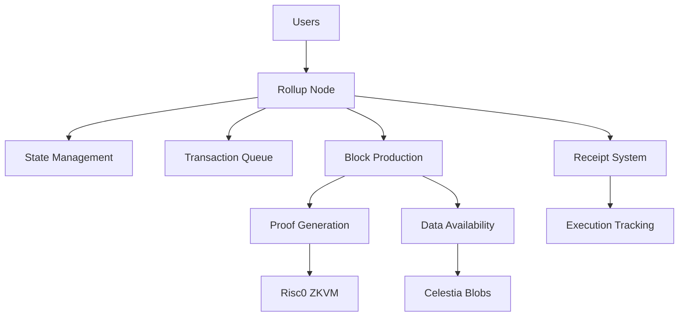

# Introduction

## Overview

Welcome to the **Rollup OS** - a comprehensive zero-knowledge rollup system built with Rust and Risc0 ZKVM. This project demonstrates a complete implementation of a Layer 2 scaling solution that combines high-performance transaction processing with cryptographic accountability and data availability guarantees.

## What is a Rollup?

A rollup is a Layer 2 scaling solution that executes transactions off-chain while maintaining security guarantees by periodically submitting compressed transaction data and cryptographic proofs to a Layer 1 blockchain. Our rollup system provides:

- **High Throughput**: Process thousands of transactions per second
- **Cryptographic Security**: Zero-knowledge proofs ensure transaction validity
- **Data Availability**: Transaction data is stored and retrievable
- **Accountability**: Detailed tracking of transaction execution results
- **Modularity**: Clean separation between execution, proving, and data availability

## Architecture Overview

Our rollup system consists of several key components working together:



### Core Components

#### 1. **Rollup Node** (`rollup-node/`)
The main execution engine that:
- Accepts and queues transactions via REST API
- Manages account state and balances
- Executes transactions with detailed tracking
- Produces blocks with cryptographic proofs
- Handles data availability publishing

#### 2. **Prover System** (`prover/`)
Zero-knowledge proof generation using Risc0 ZKVM:
- **Host Code**: Manages proof generation and verification
- **Guest Code**: Runs inside the ZKVM for secure computation
- **Methods**: Defines the proof generation interface

#### 3. **State Management**
- Account balance and nonce tracking
- Transaction execution with error handling
- State root computation and commitment
- Receipt generation and management

#### 4. **Data Availability Layer**
- Local blob storage for development
- Celestia integration for production
- Block and transaction data serialization
- Commitment hash generation

## Key Features

### 🚀 **High Performance**
- **1000+ transactions per block** by default
- **Batch processing** for optimal throughput
- **Async transaction handling** with tokio
- **Configurable block sizes** and timing

### 🔐 **Cryptographic Accountability**
- **Zero-knowledge proofs** for all state transitions
- **Receipt system** with detailed execution tracking
- **Failure classification** and error reporting
- **Merkle root commitments** for data integrity

### 📊 **Comprehensive Monitoring**
- **Real-time execution statistics**
- **Transaction success/failure rates**
- **Gas usage tracking**
- **Performance metrics**

### 🏗️ **Modular Design**
- **Clean API separation** between components
- **Configurable proof systems** (mock or real ZK)
- **Pluggable data availability** backends
- **Extensible state management**

## Technology Stack

### **Backend (Rust)**
- **Axum**: High-performance web framework
- **Tokio**: Async runtime for concurrent processing
- **Serde**: Serialization for data exchange
- **SHA2**: Cryptographic hashing
- **Risc0 ZKVM**: Zero-knowledge proof generation

### **Zero-Knowledge Proofs**
- **Risc0 ZKVM**: Virtual machine for ZK proof generation
- **Guest/Host Architecture**: Secure computation separation
- **Bincode**: Efficient proof serialization

### **Data Availability**
- **Local Storage**: Development and testing
- **Celestia Integration**: Production data availability
- **JSON Serialization**: Human-readable data format

## Getting Started

### Prerequisites
- Rust 1.70+ with Cargo
- Git for version control
- Basic understanding of blockchain concepts

### Quick Start
1. **Clone the repository**
   ```bash
   git clone <repository-url>
   cd rollup_os
   ```

2. **Build the rollup node**
   ```bash
   cd rollup-architecture/rollup-node
   cargo build --release
   ```

3. **Run the test suite**
   ```bash
   ./test_rollup_with_accountability.sh
   ```

4. **Start the rollup node**
   ```bash
   RISC0_DEV_MODE=1 cargo run --release --features prover
   ```

### API Endpoints

The rollup node exposes a REST API for interaction:

- `POST /tx` - Submit transactions
- `GET /state/:addr` - Query account state
- `POST /block/produce` - Produce new blocks
- `GET /block/:num/receipts` - Get block receipts
- `POST /blob/create` - Create data availability blobs

## Use Cases

### **Financial Applications**
- High-frequency trading systems
- Payment processing networks
- DeFi protocol scaling

### **Gaming and NFTs**
- In-game asset transfers
- NFT marketplace transactions
- Gaming economy management

### **Enterprise Solutions**
- Supply chain tracking
- Identity verification
- Audit trail management

## Security Model

Our rollup maintains security through:

1. **Cryptographic Proofs**: Every state transition is proven with ZK proofs
2. **Data Availability**: All transaction data is stored and retrievable
3. **Receipt System**: Complete audit trail of all transactions
4. **State Commitments**: Merkle roots ensure data integrity
5. **Fraud Proofs**: Invalid state transitions can be challenged

## Performance Characteristics

- **Throughput**: 1000+ transactions per second
- **Latency**: Sub-second block production
- **Storage**: Efficient blob-based data storage
- **Verification**: Fast proof verification
- **Scalability**: Horizontal scaling through sharding

## Development Status

This project is currently in **active development** with the following phases:

- ✅ **Phase 0**: Core rollup node implementation
- ✅ **Phase 1**: Zero-knowledge proof integration
- ✅ **Phase 2**: Data availability layer
- ✅ **Phase 3**: Receipt system and accountability
- 🔄 **Phase 4**: Production optimizations
- 📋 **Phase 5**: Advanced features and integrations

## Contributing

We welcome contributions! Please see our contributing guidelines and feel free to:
- Report bugs and issues
- Suggest new features
- Submit pull requests
- Improve documentation

## License

This project is licensed under the MIT License - see the LICENSE file for details.

---

*Ready to dive deeper? Check out [How it Works](./How-it-works.md) for a detailed technical walkthrough of the system architecture and implementation.*
