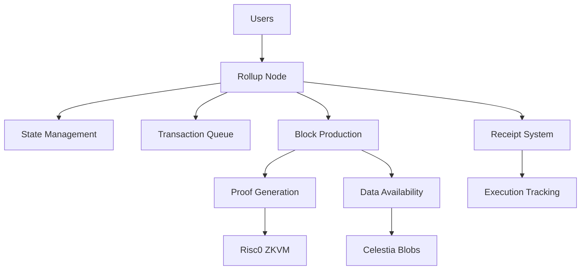
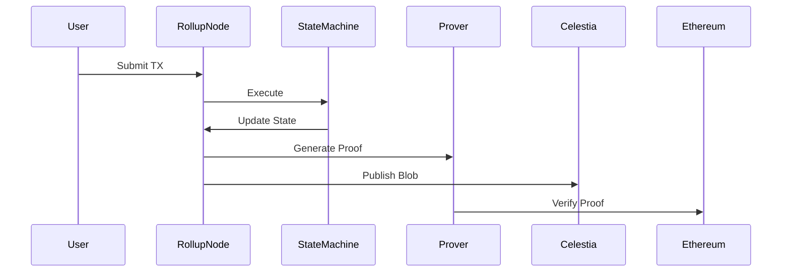

# ZeroState

**Modular. Verifiable. ZeroState.**

ZeroState is a **modular rollup operating system** for building **sovereign, verifiable state machines**.  
It enables developers to define custom execution environments while inheriting **cryptographic security, data availability, and settlement guarantees**.

---

## Overview

ZeroState redefines rollup architecture by treating **state machines as first-class primitives**.

Instead of restricting developers to predefined execution environments (e.g., EVM), ZeroState provides a framework to build:

- Custom execution logic (application-specific state machines)
- zk-verifiable state transitions (RiscZero / zkVM)
- Modular data availability (Celestia)
- Secure settlement (Ethereum / Base / Starknet-ready)

This results in a system where **execution, proofs, DA, and settlement are fully decoupled yet composable**.

---

## Core Insight

Most blockchain systems optimize *one layer*:

- DA → Celestia  
- Proofs → zkVMs  
- Execution → Rollups  

ZeroState unifies all of them into a **single programmable abstraction**:

> A **verifiable state machine rollup OS**

---

## Architecture

Our rollup system consists of several key components working together:




## System Components

### 1. Rollup Node (Execution Layer)

The rollup node is the **execution engine + orchestrator**.

**Responsibilities:**

* Accept transactions via REST API
* Maintain transaction queue
* Execute state transitions
* Trigger block production
* Coordinate proof + DA publishing

**Key APIs:**

* `POST /tx` → Submit transaction
* `POST /block/produce` → Produce block
* `GET /state/:addr` → Query state

---

### 2. State Machine (Execution Core)

ZeroState uses a **custom state machine model**, not EVM-bound execution.

Each transaction follows:

1. Validation (nonce, balance, format)
2. Execution (state update)
3. Receipt generation
4. State commitment

```rust
struct Account {
    balance: u128,
    nonce: u64,
}
```

---

### 3. Receipt System (Execution Accountability)

Every transaction produces a **receipt with explicit execution outcome**:

```rust
enum TxStatus {
    Success,
    Revert(String),
    InvalidNonce,
    InsufficientBalance,
}
```

Receipts are committed via a **Merkle root**, enabling:

* Light client verification
* Transparent execution tracking
* Fraud detection

---

### 4. Block Production

Transactions are batched into blocks:

```rust
struct RollupBlock {
    block_number: u64,
    transactions: Vec<Tx>,
    prev_state_root: String,
    new_state_root: String,
}
```

Pipeline:

1. Drain mempool
2. Execute transactions
3. Generate receipts
4. Compute state root
5. Trigger proof + DA

---

### 5. Zero-Knowledge Proof Layer

ZeroState uses **zkVM-based proving (RiscZero)**:

```rust
struct PublicInputs {
    prev_root: String,
    post_root: String,
    receipts_root: String,
    blob_hash: String,
    oracle_commit: String,
}
```

Proof guarantees:

* Correct execution
* Valid state transitions
* Integrity of receipts and DA linkage

---

### 6. Data Availability (Celestia)

Block data is published as **blobs**:

```rust
struct CelestiaBlob {
    namespace_id: String,
    data: Vec<u8>,
    commitment: String,
}
```

Ensures:

* Data is retrievable
* Independent verification possible
* Trust-minimized rollup design

---

### 7. Settlement Layer (Ethereum / Base)

Ethereum acts as the **finality layer**:

* State roots are submitted
* Proofs are verified (zk/fraud)
* Final state becomes canonical

Provides:

* Economic security
* Finality guarantees
* Interoperability base

---

## Transaction Lifecycle



---

## Performance

* ~1000 transactions per block (configurable)
* ~100+ TPS (current)
* ~1–2 second block production
* Efficient blob-based storage

---

## Security Model

ZeroState ensures security through:

* **zk proofs** → execution correctness
* **Merkle commitments** → state + receipts integrity
* **Data availability blobs** → retrievability
* **Nonce enforcement** → replay protection

---

## Modularity

| Layer      | Implementation             |
| ---------- | -------------------------- |
| Execution  | Custom State Machines      |
| Proofs     | RiscZero / SP1             |
| DA         | Celestia                   |
| Settlement | Ethereum / Base / Starknet |

---

## Why ZeroState?

* Not EVM-bound → custom execution
* Fully modular → replace any layer
* Verifiable → zk-native design
* Extensible → supports new paradigms

---

## Roadmap

### Phase 0

* Rollup node
* State machine
* DA integration
* Settlement prototype

### Phase 1

* zk proofs
* SDK + tooling

### Phase 2

* Starknet integration
* Cross-rollup interoperability

---

## Testing

* 50,000+ transaction stress tests
* Proof generation validation
* Receipt verification
* DA blob consistency checks

---

## Vision

ZeroState is not just a rollup.

It is an **operating system for verifiable computation on blockchains**.

---

## Getting Started

```bash
cargo run --release
```

Submit transaction:

```bash
curl -X POST http://localhost:8080/tx ...
```

---

## License

MIT

```

---


